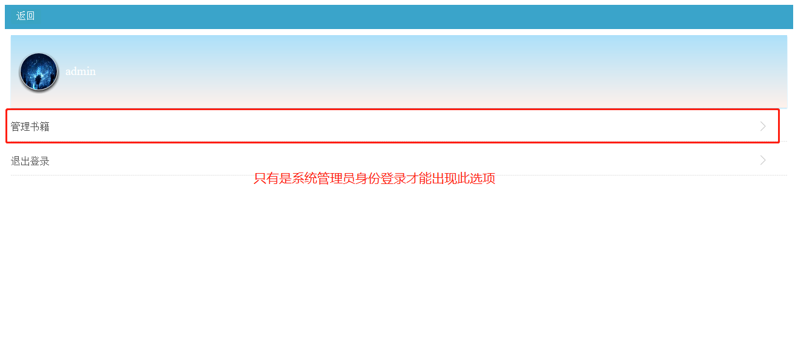

# Novel
基于Struts2和Hibernate的小说网站，实现了前端页面和后台管理功能

## 小说网站项目说明

1、导入数据库

从压缩文件中导入novel.dmp

命令：DOS窗口运行命令

imp Oracle用户/密码 file=文件路径\novel.dmp tables=classification,chapters,identify,users,novel
2、创建序列

打开数据准备.txt,然后到oracle数据库中执行里边代码

3、运行环境：jdk1.8,tomcat9.0，Spring-tool-suite4

4、访问路径：http://localhost:8080/Novel/index

5、演示地址：http://121.5.189.240:8080/Novel/index

6、系统管理员账号密码都是admin

7、普通用户账号密码都是tes

8、实现功能：登录注册、小说首页、小说分类、分类详情、小说详情、章节详情（只有在已登录状态下才能

看）、个人主页

注：以下页面只有系统管理员登录才可访问

管理员页面、管理分类页面、管理书籍页面、管理章节、管理用户、下载图片、修改页面

9、主要功能运行截图：

登录页面：

 

 

 

注册页面：

 

 

 

首页：

 

 

 

分类：

 

 

 

分类详情：

 

 

 

小说详情：

 

 

 

章节详情（只有在已登录状态下才能看）：

 

 

 

个人主页：

 

 

 

***\*注：以下页面只有系统管理员登录才可访问\****

管理员页面：

 

 

 

管理分类页面：

 

 

 

管理书籍页面：

 

 

 

管理章节：

 

 

 

管理用户：

 

 

下载图片：

 

 

修改页面：

 
